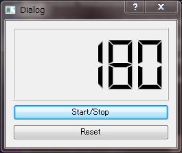

RamenTimer
====

# Description
ラーメンタイマー

# Requirement
- Python 2.7.x
- PySide

# Usage
## アプリの起動  
`$ python main.py`

## Start/Stop ボタン
カウントダウンを開始します。
今のところストップはできません。

## Reset ボタン
今のところ何もできません。

# Install
以下のコマンドで任意のディレクトリに clone してください。  
`$ git clone git@github.com:matsu490/RamenTimer.git`  
または任意のディレクトリに ZIP ファイルをダウンロードして解凍してください。

# Author
[matsu490](https://github.com/matsu490)
